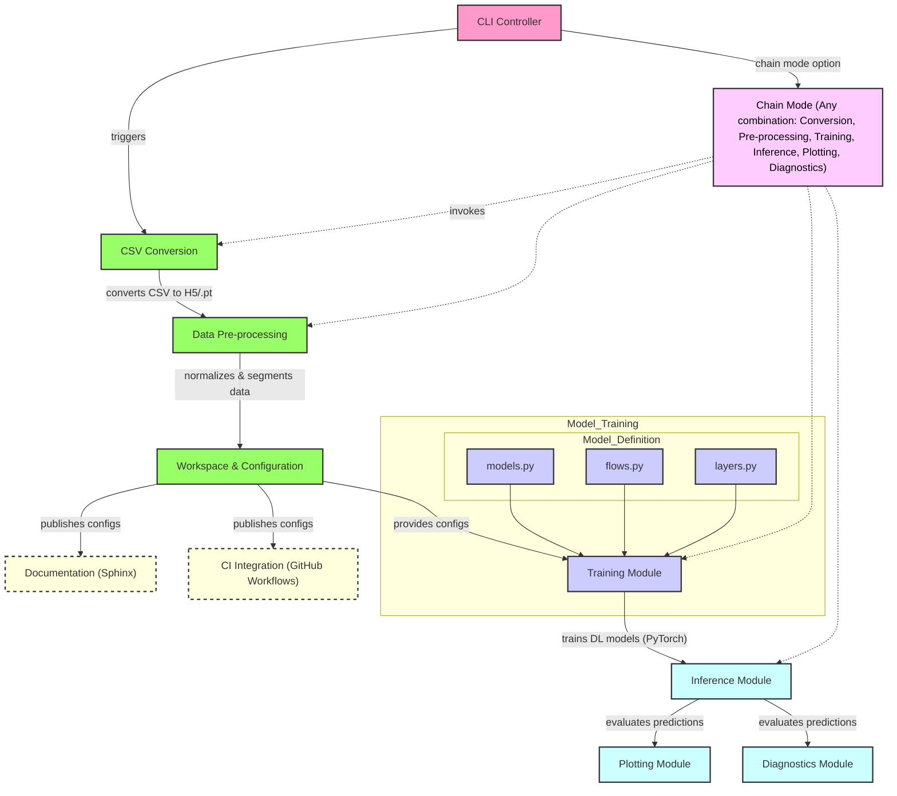

[](https://doi.org/10.5281/zenodo.14888114)
[](https://opensource.org/licenses/Apache-2.0)

[](https://github.com/PRAkTIKal24/BEAD/actions)


# BEAD
**Background Enrichment for Anomaly Detection**
|| *{Background Enrichis pour (la Détection d'Anomalies) Anomalie Détection}*


BEAD is a Python package that uses deep learning based methods for anomaly detection in HEP data for new physics searches. BEAD has been designed with modularity in mind, to enable usage of various unsupervised latent variable models for anomaly detection by design, but any tasks beyond this scope as well with easily customizable modules. 

BEAD has five main running modes:

- Data handling: Deals with handling file types, conversions between them and pre-processing the data to feed as inputs to the DL models.

- Training: Train your model to learn implicit representations of your background data that may come from multiple sources/generators to get a single, encriched latent representation of it.

- Inference: Using a model trained on an enriched background, feed in samples you want to detect anomalies in and watch the magic happen.

- Plotting: After running Inference, or Training you can generate plots similar towhat is shown in the paper. These include performance plots as well as different visualizations of the learned data.

- Diagnostics: Enabling this mode allows running profilers that measure a host of metrics connected to the usage of the compute node you run on to help you optimize the code if needed(using CPU-GPU metrics).

For more information, follow the install instructions below go to the directory `./BEAD/bead/` and then run the command ```poetry run bead -h``` to get detailed instructions on running the package and the available customizations.


# Package Workflow:



For a full chain example, look [below](#example)!

Bead has several versions each targetting different operating conditions (local or HPC cluster; CPU or GPU or multi-CPU-GPU distributed runs etc.). After the first full release, we will add a list mapping each stable version with the computing environment it was desinged for. For now, `prod_local` is the stable branch for running on a low compute device for e.g. the lame laptop your Univeristy gave you :P.


# Installing and Test Driving the package
1. uv Package Manager: BEAD is now managed by the uv package manager - this simplifies the task of creating an environment, installing the right dependencies, and resolving version incompatibilities. Start by installing uv according to the instructions given [here](https://github.com/astral-sh/uv)

2. Trimap is a visualization tool that is used in the package but is currently problematic to install via uv due to `llvmlite==0.34.0` version issue on Mac M1. As a workaround to this either `uv pip install trimap` or if you are running inside a `conda` env, install trimap with BioConda as described [here](https://bioconda.github.io/recipes/trimap/README.html), before moving to the next step.

3. After installing uv, clone this repository to your working directory.

4. Make sure you are on the same directory level as this `README.md` file

5. Install the BEAD package using:

         uv pip install -e . # alternatively you can also use `uv sync`

6. You are now ready to start running the package! As a first step try the following command:

         uv run bead -h

  This should bring up the help window that explains all the various running modes of bead.

7. Start with creating a new workspace and project like so:

         uv run bead -m new_project -p <WORKSPACE_NAME> <PROJECT_NAME>

   This will setup all the required directories inside `BEAD/bead/workspaces/`.

   For any of the operation modes below, if you would like to see verbose outputs to know exactly what is going on, use the `-v` flag at the end of     the command like so:

         uv run bead -m new_project -p <WORKSPACE_NAME> <PROJECT_NAME> -v

   **Remember** to use a different workspace everytime you want to modify your input data, since all the projects inside a given workspace share and overwrite the input data.

   If you want to use the same input data but change something else in the pipeline (for eg. different config options such as `model_name`, `loss_function` etc.), use the same `workspace_name`, 
   but create a new project with a different `'project_name'`. On doing this, your data will already be ready from the previous project in that workspace so you can skip directly to the 
   subsequent steps.

8. After creating a new workspace, it is essential to move the `<FLAG>_*.csv` files to the `BEAD/bead/workspaces/WORKSPACE_NAME/data/csv/` directory. As a naming convention for simpler data processing, the package currently expects the file names to start with either of these `<FLAG>` options: `[bkg_train, bkg_test, sig_test]`. Note, that all csv files starting with a specific flag will be concatenated into a single `h5 Dataset` by the next steps, such that after preprocessing you are left with the 3 corresponding Datasets. The names of the file trailing the `<FLAG>` can be descriptive and these names are stored and used later while making plots.

9. After making sure the input files are in the right location, you can start converting the `csv` files to the file type specified in the `BEAD/bead/workspaces/<WORKSPACE_NAME>/<PROJECT_NAME>/config/<PROJECT_NAME>_config.py` file. `h5` is the default and preferred method. To run the conversion mode, use:

         uv run bead -m convert_csv -p WORKSPACE_NAME PROJECT_NAME

   This should parse the csv, split the information into event-level, jet-level and constituent-level data.

11. Then you can start data pre-processing based on the flags in the config file, using the command:

         uv run bead -m prepare_inputs -p WORKSPACE_NAME PROJECT_NAME

    This will create the preprocessed tensors and save them as `.pt` files for events, jets and constituents separately.

12. Once the tensors are prepared, you are now ready to train the model chosen in the configs along with all the specified training parameters, using:

         uv run bead -m train -p WORKSPACE_NAME PROJECT_NAME

    This should store a trained pytorch model as a `.pt` file in the `.../PROJECT_NAME/output/models/` directory as well as train loss metrics in the `.../PROJECT_NAME/output/results/`       
    directory.

13. After a trained model has been saved, you are now ready to run inference like so:

         uv run bead -m detect -p WORKSPACE_NAME PROJECT_NAME

    This will save all model outputs in the `.../PROJECT_NAME/output/results/` directory.

14. The plotting mode is called on the outputs from the previous step like so:

         uv run bead -m plot -p WORKSPACE_NAME PROJECT_NAME

    This will produce all plots.

    If you would like to only produce plots for training losses, use the `-o` flag like so:

         uv run bead -m plot -p WORKSPACE_NAME PROJECT_NAME -o train_metrics

    If you only want plots from the inference, use:

         uv run bead -m plot -p WORKSPACE_NAME PROJECT_NAME -o test_metrics

15. Chaining modes to avoid repetitive running of commands is facilitated by the `-m chain` mode, which **requires** the `-o` flag to determine which modes need to be chained and in what order. Look at the example below.

# Fullchain Example

Say I created a new workspace that tests `SVJ` samples with `rinv=0.3` and a new project that runs the `ConvVAE` model for `500 epochs` with a learning rate of `1e-4` like so:

      uv run bead -m new_project -p svj_rinv3 convVae_ep500_lr4

Then I moved the input `CSVs` to the `BEAD/bead/workspaces/svj_rinv3/data/csv/` directory. Then I want to run all the modes until the inference step, I just need to run the command:

      uv run bead -m chain -p svj_rinv3 convVae_ep500_lr4 -o convertcsv_prepareinputs_train_detect

and I'm good to log off for a snooze! I come back, run the plotting mode:

      uv run bead -m plot -p svj_rinv3 convVae_ep500_lr4

Looking at the plots, I feel maybe the ConvVAE augmented with the planar flow would do better on the same data. Since I don't want to change the input data, I don't need to generate it again, I can use the same workspace and just create a new project. Lets name the new project `PlanarFlowConvVAE_ep500_lr4`:

      uv run bead -m new_project -p svj_rinv3 PlanarFlowConvVae_ep500_lr4

Now I go into the `.../workspaces/svj_rinv3/PlanarFlowConvVae_ep500_lr4/config/PlanarFlowConvVae_ep500_lr4_config.py` file and change the following line:

                c.model_name                   = "ConvVAE"

   to

                c.model_name                   = "Planar_ConvVAE"

Since that is the name of the model I want to use in the `...src/models/models.py` file.


Then I want to generate plots for the new mmodel so I can compare them to the previous run. I want to use the same inputs, so I don't need to use the `convert_csv` and `prepare_inputs` modes. I can directly run the command:

      uv run bead -m chain -p svj_rinv3 PlanarFlowConvVae_ep500_lr4 -o train_detect_plot

After my mandatory training snooze, I come back to plots and that makes me realize that I should be preprocessing the inputs differently to get better results. Since I want to change the inputs I will have to create a new workspace and project altogehter. Let's say I want to use the Standard Scaler on the inputs instead of the default normalization, and I want to test on the same SVJ samples. I need to run:

      uv run bead -m new_project -p StandardScaled_svj_rinv3 PlanarFlowConvVae_ep500_lr4

Then I go back into the config file and make the changes like before and on top of that, change the `normalizations` flag to `standard`. Since this is the first project of this new workspace, I need to run:

      uv run bead -m chain -p StandardScaled_svj_rinv3 PlanarFlowConvVae_ep500_lr4 -o convertcsv_prepareinputs_train_detect_plot

followed by.. ofc, the mandatory snooze!

# Making the most of multi-GPU setups on HPCs

Bead now supports multi-GPU training via torch DDP! As a bonus we've also added optional torch AMP wrappers as well as gradient clipping for even faster training of large models on massive datasets! 
While AMP works just as well with the set of instructions above (managed by uv), DDP is a different ballgame.
Here's how you use it:

Assuming you plan to use DDP in an HPC setting, you most likely have job schedulers you use that come with their own submit scripts. Given that DDP cannot run with the previous commands and requires special attential via the `torchrun` command, we will have to make the environment that `uv` creates and manages with every call.

1. So first create a venv directory somewhere using `mkdir` and install all BEAD's dependencies like so:

```
uv pip install -e <PATH_TO_VENV>
```

3. Then source the venv using:

```
source <PATH_TO_ENV>/bin/activate
```

   Optionally you can use this block in a shell script to make sure the venv
```
# --- Activate the uv-created Virtual Environment ---
echo "Activating Python virtual environment: $VENV_PATH"
if [ -f "$VENV_PATH/bin/activate" ]; then
    source "$VENV_PATH/bin/activate"
    echo "Virtual environment activated."
    echo "Python executable: $(which python)"
    # Optional: Verify 'art' can be imported by the Python in the venv
    # python -c "import art; print('Successfully imported art in Slurm script')"
else
    echo "ERROR: Virtual environment activation script not found at $VENV_PATH/bin/activate"
    exit 1
fi 
```

3. Collect information on all the GPUs you have available (the current codebase has only been tested for multiple instances of the same GPU (eg. 3 V100s); cross-chip performance is unknown and thereby unsupported currently - keep a check on the torch DDP website for updates on this, and make a PR here when ready ;-) ). You will need to know how many nodes you are planning to run on and how many GPUs you have available per node.

4. Once you have all this info, you can start training using DDP like so (this example is for 1 node with 3 V100 GPUs):

```
torchrun --standalone --nnodes=1 --nproc_per_node=3 -m bead.bead -m chain -p $WORKSPACE_NAME $PROJECT_NAME -o $OPTIONS -v
```

*Happy hunting!*


# CRVSTAL
***C*ontrastive *R*epresentations in *V*AE *S*tructures for *T*agging *A*nomalies in the *L*atent *S*pace**


# News
* [x] *25 May* - BEAD now supports a new class of models (losses) called CRVSTAL with one stable variant!
* [ ] *TBD* - New CRVSTAL losses to follow!
* [ ] *16 June* - BEAD talk and poster at EuCAIFCon '25 @ Cagliari, Sardinia!

